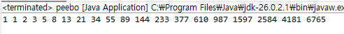

# OOP2026
### Homework 1
```java
public class pyramid {
	public static void main(String[] args)
    {
        int i;
        int j;
        for (i=1; i<11; i++)
        {
            for (j=1; j<=i; j++)
            {
                System.out.print("#");
            }
            System.out.println();
        }
        System.out.println();

        for (i=10; i>0; i--)
        {
            for (j=1; j<=i; j++)
            {
                System.out.print("#");
            }
            System.out.println();
        }
        System.out.println();

        for (i=10; i>0; i--)
        {
            for (j=1; j<=i; j++)
            {
                System.out.print(" ");
            }
            for (; j<=10; j++)
            {
                System.out.print("#");
            }
            System.out.println();
        }
        System.out.println();

        for (i=0; i<10; i++)
        {
            for (j=0; j<=i; j++)
            {
                System.out.print(" ");
            }
            for (; j<10; j++) {
                System.out.print("#");
            }
            System.out.println();
        }
    }
}
```


### Homework 2
```java
package Rho;

public class peebo {
	public static void main(String[] args) {
		int a = 1;
		int b = 1;
		int c = 0;
		
		System.out.print(a+" "+b);
		for(int i = 0; i < 18; i++) {
			c = a + b;
			System.out.print(" "+c);
			a = b;
			b = c;
	}
}
}
```


