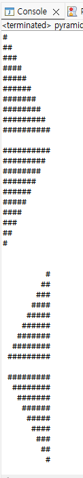

# OOP2026
### Homework1
```java
public class pyramid {
	public static void main(String[] args)
    {
        int i;
        int j;
        for (i=1; i<11; i++)
        {
            for (j=1; j<=i; j++)
            {
                System.out.print("#");
            }
            System.out.println();
        }
        System.out.println();

        for (i=10; i>0; i--)
        {
            for (j=1; j<=i; j++)
            {
                System.out.print("#");
            }
            System.out.println();
        }
        System.out.println();

        for (i=10; i>0; i--)
        {
            for (j=1; j<=i; j++)
            {
                System.out.print(" ");
            }
            for (; j<=10; j++)
            {
                System.out.print("#");
            }
            System.out.println();
        }
        System.out.println();

        for (i=0; i<10; i++)
        {
            for (j=0; j<=i; j++)
            {
                System.out.print(" ");
            }
            for (; j<10; j++) {
                System.out.print("#");
            }
            System.out.println();
        }
    }
}
```



