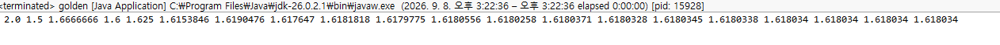
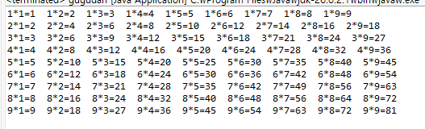
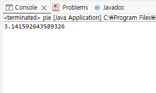
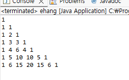
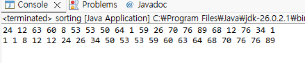
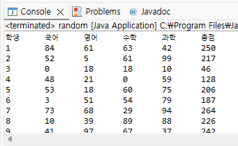

# OOP2026
### Homework 1
```java
public class pyramid {
	public static void main(String[] args)
    {
        int i;
        int j;
        for (i=1; i<11; i++)
        {
            for (j=1; j<=i; j++)
            {
                System.out.print("#");
            }
            System.out.println();
        }
        System.out.println();

        for (i=10; i>0; i--)
        {
            for (j=1; j<=i; j++)
            {
                System.out.print("#");
            }
            System.out.println();
        }
        System.out.println();

        for (i=10; i>0; i--)
        {
            for (j=1; j<=i; j++)
            {
                System.out.print(" ");
            }
            for (; j<=10; j++)
            {
                System.out.print("#");
            }
            System.out.println();
        }
        System.out.println();

        for (i=0; i<10; i++)
        {
            for (j=0; j<=i; j++)
            {
                System.out.print(" ");
            }
            for (; j<10; j++) {
                System.out.print("#");
            }
            System.out.println();
        }
    }
}
```


### Homework 2
```java
package Rho;

public class peebo {
	public static void main(String[] args) {
		int a = 1;
		int b = 1;
		int c = 0;
		
		System.out.print(a+" "+b);
		for(int i = 0; i < 18; i++) {
			c = a + b;
			System.out.print(" "+c);
			a = b;
			b = c;
	}
}
}
```


### Homework 3
```java
package Rho;

public class golden {
	public static void main(String[] args) {
		float a=2;
		float b=1;
		float c;
		for (int i=0; i<20; i++) {
			System.out.print(" "+a / b);
            c = a + b;
            b = a;
            a = c;				
		}
	}
}
```


### Homework 4
```java
package Rho;

public class gugudan {
    public static void main(String[] args) {
        for (int i = 1; i <= 9; i++) {
            for (int j = 1; j <= 9; j++) {
                System.out.print(i + "*" + j + "=" + (i * j) + "  ");
            }
            System.out.println();
        }
}
}
```



### Homework 5
```java
package Rho;

public class pie {
    public static void main(String[] args) {
        int n = 100000000;
        double pi = 0;

        for (int k = 0; k < n; k++) {
            pi += Math.pow(-1, k) / (2 * k + 1);
        }

        System.out.println(4 * pi);
    }
}
```



### Homework 6
```java
package Rho;

public class ehang {
	public static void main(String[] args) {
        int n = 6;
        int binomial[][] = new int[n + 1][n + 1];

        for (int i = 0; i <= n; i++) {
            binomial[i][0] = 1;
            binomial[i][i] = 1;

            for (int j = 1; j < i; j++) {
                binomial[i][j] =
                    binomial[i - 1][j - 1] + binomial[i - 1][j];
            }
        }

        for (int i = 0; i <= n; i++) {
            for (int j = 0; j <= i; j++) {
                System.out.print(binomial[i][j] + " ");
            }
            System.out.println();
        }
    }
}
```



### Homework 7
```java
package Rho;

public class sorting {
	public static void main(String[] args) {

        int data[] = new int[20];

        for (int i = 0; i < 20; i++)
            data[i] = (int)(Math.random() * 100);

        for (int i = 0; i < 20; i++)
            System.out.print(data[i] + " ");

        System.out.println();

        for (int i = 0; i < 19; i++) {
            int min = i;

            for (int j = i + 1; j < 20; j++) {
                if (data[j] < data[min])
                    min = j;
            }

            int temp = data[i];
            data[i] = data[min];
            data[min] = temp;
        }

        for (int i = 0; i < 20; i++)
            System.out.print(data[i] + " ");
    }
}
```



### Homework 8
```java
package Rho;

public class random {
    public static void main(String[] args) {

        int score[][] = new int[30][4];

        for (int i = 0; i < 30; i++) {
            for (int j = 0; j < 4; j++) {
                score[i][j] = (int)(Math.random() * 101);
            }
        }

        System.out.println("학생\t국어\t영어\t수학\t과학\t총점");

        for (int i = 0; i < 30; i++) {
            int sum = 0;

            System.out.print((i + 1) + "\t");

            for (int j = 0; j < 4; j++) {
                System.out.print(score[i][j] + "\t");
                sum += score[i][j];
            }

            System.out.println(sum);
        }
    }
}
```


