### Homework 1
```java
public class pyramid {
	public static void main(String[] args)
    {
        int i;
        int j;
        for (i=1; i<11; i++)
        {
            for (j=1; j<=i; j++)
            {
                System.out.print("#");
            }
            System.out.println();
        }
        System.out.println();

        for (i=10; i>0; i--)
        {
            for (j=1; j<=i; j++)
            {
                System.out.print("#");
            }
            System.out.println();
        }
        System.out.println();

        for (i=10; i>0; i--)
        {
            for (j=1; j<=i; j++)
            {
                System.out.print(" ");
            }
            for (; j<=10; j++)
            {
                System.out.print("#");
            }
            System.out.println();
        }
        System.out.println();

        for (i=0; i<10; i++)
        {
            for (j=0; j<=i; j++)
            {
                System.out.print(" ");
            }
            for (; j<10; j++) {
                System.out.print("#");
            }
            System.out.println();
        }
    }
}
```
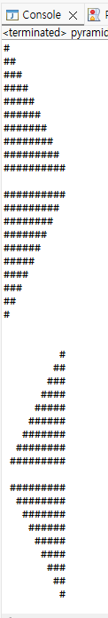

### Homework 2
```java
package Rho;

public class peebo {
	public static void main(String[] args) {
		int a = 1;
		int b = 1;
		int c = 0;
		
		System.out.print(a+" "+b);
		for(int i = 0; i < 18; i++) {
			c = a + b;
			System.out.print(" "+c);
			a = b;
			b = c;
	}
}
}
```
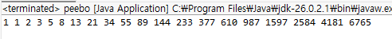

### Homework 3
```java
package Rho;

public class golden {
	public static void main(String[] args) {
		float a=2;
		float b=1;
		float c;
		for (int i=0; i<20; i++) {
			System.out.print(" "+a / b);
            c = a + b;
            b = a;
            a = c;				
		}
	}
}
```
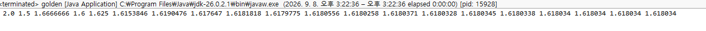

### Homework 4
```java
package Rho;

public class gugudan {
    public static void main(String[] args) {
        for (int i = 1; i <= 9; i++) {
            for (int j = 1; j <= 9; j++) {
                System.out.print(i + "*" + j + "=" + (i * j) + "  ");
            }
            System.out.println();
        }
}
}
```

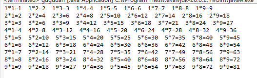

### Homework 5
```java
package Rho;

public class pie {
    public static void main(String[] args) {
        int n = 100000000;
        double pi = 0;

        for (int k = 0; k < n; k++) {
            pi += Math.pow(-1, k) / (2 * k + 1);
        }

        System.out.println(4 * pi);
    }
}
```

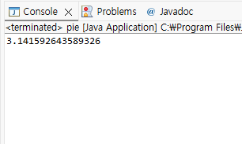

### Homework 6
```java
package Rho;

public class ehang {
	public static void main(String[] args) {
        int n = 6;
        int binomial[][] = new int[n + 1][n + 1];

        for (int i = 0; i <= n; i++) {
            binomial[i][0] = 1;
            binomial[i][i] = 1;

            for (int j = 1; j < i; j++) {
                binomial[i][j] =
                    binomial[i - 1][j - 1] + binomial[i - 1][j];
            }
        }

        for (int i = 0; i <= n; i++) {
            for (int j = 0; j <= i; j++) {
                System.out.print(binomial[i][j] + " ");
            }
            System.out.println();
        }
    }
}
```

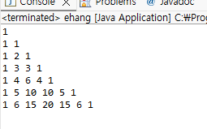

### Homework 7
```java
package Rho;

public class sorting {
	public static void main(String[] args) {

        int data[] = new int[20];

        for (int i = 0; i < 20; i++)
            data[i] = (int)(Math.random() * 100);

        for (int i = 0; i < 20; i++)
            System.out.print(data[i] + " ");

        System.out.println();

        for (int i = 0; i < 19; i++) {
            int min = i;

            for (int j = i + 1; j < 20; j++) {
                if (data[j] < data[min])
                    min = j;
            }

            int temp = data[i];
            data[i] = data[min];
            data[min] = temp;
        }

        for (int i = 0; i < 20; i++)
            System.out.print(data[i] + " ");
    }
}
```

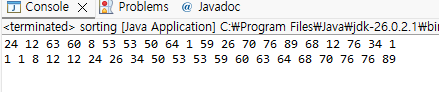

### Homework 8
```java
package Rho;

public class random {
    public static void main(String[] args) {

        int score[][] = new int[30][4];

        for (int i = 0; i < 30; i++) {
            for (int j = 0; j < 4; j++) {
                score[i][j] = (int)(Math.random() * 101);
            }
        }

        System.out.println("학생\t국어\t영어\t수학\t과학\t총점");

        for (int i = 0; i < 30; i++) {
            int sum = 0;

            System.out.print((i + 1) + "\t");

            for (int j = 0; j < 4; j++) {
                System.out.print(score[i][j] + "\t");
                sum += score[i][j];
            }

            System.out.println(sum);
        }
    }
}
```

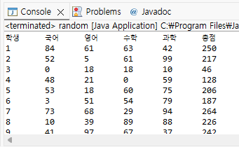

05
025
0125
00625
003125
0015625
### Homework 9

(1.75)_10 (1.11)_2 

(1.625)_10 (1.101)_2

(1.5625)_10 (1.1001)_2

(1.875)_10 (1.111)_2

(13.875)_10 (1101.111)_2

(45.875)_10 (101101.111)_2

(1.9)_10 (1.1110011001100...)_2

(1.1)_10 (1.000110011001100...)_2

### Homework 10
```java
package Rho;

public class Histogram {

	public static void main(String[] args) {
		
		int[] data = new int[100];
		int[] histogram = new int[10];
		
		for (int i = 0; i < data.length; i++) {
			data[i] = (int)(Math.random() * 100);
		}
		
		for (int i = 0; i < data.length; i++) {
			histogram[data[i] / 10]++;
		}
		
		for (int i = 0; i < histogram.length; i++) {
			System.out.printf("%d~%d\t", i * 10, i * 10 + 9);
			
			for (int j = 0; j < histogram[i]; j++) {
				System.out.print("#");
			}
			
			System.out.println();
		}
	}
}
```
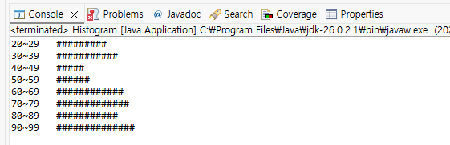

# homework11

```java

public class HELLOWORLD {

    public static void main(String[] args) {
        // TODO Auto-generated method stub
        int array_count;
        if (args.length != 1)
            return;
        
        array_count = Integer.parseInt(args[0]);
        int[] arr = new int[array_count];
        
        for (int i = 0; i < array_count; i++) {
            arr[i] = (int) (Math.random() * 100) + 1;
        }
        
        for (int i = 0; i < array_count; i++) {
            System.out.print(arr[i] + " ");  
        }
        System.out.println();
        
        double sum = 0;
        for (int i = 0; i < array_count; i++) {
            sum += arr[i];
        }
        System.out.printf("arithematic mean : = %f\n", sum / array_count);
        
        double prod = 1;
        for (int i = 0; i < array_count; i++) {
            prod *= arr[i];
        }
        System.out.printf("geometric mean   : = %f\n", Math.pow(prod, (double) 1. / array_count));
        
        double harmonic_sum = 0;
        for (int i = 0; i < array_count; i++) {
            harmonic_sum += 1.0 / arr[i];
        }
        System.out.printf("harmonic mean    : = %f\n", array_count / harmonic_sum);
        
        int[] sortedArr = arr.clone();
        java.util.Arrays.sort(sortedArr);
        double median;
        if (array_count % 2 == 0) {
            median = (sortedArr[array_count / 2 - 1] + sortedArr[array_count / 2]) / 2.0;
        } else {
            median = sortedArr[array_count / 2];
        }
        System.out.printf("median           : = %f\n", median);
    }
}

```
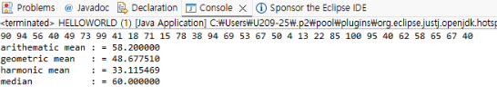

# homework13

```java

import java.util.Scanner;

public class HELLOWORLD {
public static void main(String[] args) {
    int out;
    while(true) {
        Scanner scanner = new Scanner(System.in);
        String inputString = scanner.nextLine();
        System.out.println(inputString);
        String[] arrOfStr = inputString.split(" ");
        for ( int i=0; i<arrOfStr.length; i++) {
            System.out.println(arrOfStr[i]);
        }
        if(arrOfStr[1].equals("+")) {
            out = Integer.parseInt(arrOfStr[0])+Integer.parseInt(arrOfStr[2]);
            System.out.println(out);
        }
        else if(arrOfStr[1].equals("-")) {
            
        }
        else if(arrOfStr[1].equals("#")) {
            
        }
        else if(arrOfStr[1].equals("/")) {
            
        }
    }
 }
}
```
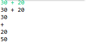
